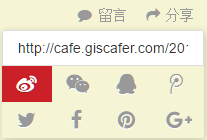
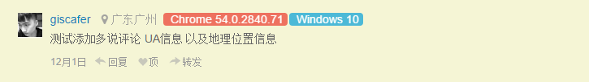

# hexo-theme-cafe

Cafe 主题旨在追求简约、操作简单、阅读舒适度。 英文版介绍 [Read in English](./README_en.md)

Inspire by [Landscape](https://github.com/hexojs/hexo-theme-landscape)，目前版本主要调整了整体的样式，布局细调，以及新增一些widget等，后期会在使用的过程中不断进行调整。

（色调有点像阮大神博客？是的，有借参考，个人觉得看久了眼睛舒服，如果后期调整或者改动大，该版本也会保留，喜欢的朋友拿去）

PC端体验：http://cafe.giscafer.com/ 或参考本人博客 [Giscafer's blog](http://giscafer.com)

响应式兼容手机端，扫码预览演示demo：


## 效果截图


## 使用

### 安装

    $ git clone https://github.com/giscafer/hexo-theme-cafe.git themes/cafe


**Cafe 需要 Hexo 2.4 及以上版本支持.**

### 使用主题

    修改博客配置文件 `_config.yml` 主题属性 theme 为 `cafe`.

### 更新升级

    cd themes/cafe
    git pull


## 主题配置

主题 `themes/cafe/_config.yml` 文件内容参考说明配置

```yml
# Header
menu:
  首页: /
  归档: /archives
rss: /atom.xml

# footer底部显示联系邮箱（在博客配置文件下添加email配置也是一样的效果）
email: 'youremail@outlook.com'

# Content
excerpt_link: 继续阅读全文 »
fancybox: true

# Sidebar
sidebar: right
# 目录展示位置，有两种选择，post为文章内部右侧；widget为sidebar形式展示，在markdown文件中通过toc:false可以指定某文章不展示目录
content_position: widget
# true目录将会浮动固定位置，false则相反，当且仅当content_position=widget时该设置值有效
content_display_fixed: true

widgets:
- post_content      # 文章目录
- category          # 归类
- tag               # 标签
- tagcloud          # 云标签
- recent_posts      # 最新文章
- lastest_comments  # 最新评论
- hot_comment_posts # 热评文章
- archives          # 归档

# display widgets at the bottom of index pages (pagination == 2)
index_widgets:
# - category
# - tagcloud
# - archive

# widget behavior
archive_type: 'monthly'
show_count: false

# 标签云TagClound
# 如果启动，则会随机自定义标签云颜色
tagcloud_color: false 


# 其他参数
google_analytics:
favicon: /favicon.png
# 若使用多说，此处填写的是多说评论账号ID
# 若使用Disqus，请在博客 config 文件中填写disqus_shortname，并设置duosuo: false关闭多说评论
duoshuo_shortname: false
google_plus:
fb_admins:
fb_app_id:


```

- menu - 导航菜单
- rss - RSS 链接
- excerpt_link - "Read More" 在文章底部显示阅读更多字样，设置`false`则隐藏
- fancybox - 启用 Fancybox
- sidebar - 侧边栏（Sidebar）样式。 有 left, right, bottom or false 四个可选属性
- widgets - 在侧边栏`sidebar`显示的组件
- google_analytics - Google Analytics ID
- favicon - Favicon 路径
- twitter - Twiiter ID
- google_plus - Google+ ID


## Features

### 社区化

支持国内外主流社区分享：



支持`Disqus`与`多说`两种方式评论



### Fancybox

Cafe 使用`Fancybox` 展示相册、图片。 您可以使用减记语法或fancybox标签插件添加你的照片。

    

    

### Sidebar

你可以设置`sidebar` 配置侧边栏，有 `left`、`right`、`bottom` 三种选择

Cafe 主题提供**7**个内置 widgets:

- category          # 归类
- tag               # 标签
- tagcloud          # 云标签
- archives          # 归档
- recent_posts      # 最新文章
- lastest_comments  # 最新评论
- hot_comment_posts # 热评文章

你可以在主题配置文件 `widget` 设置选项设置需要的 widgets。

## [开发历史 Changelog](https://github.com/giscafer/hexo-theme-cafe/wiki/Changelog)

## License

MIT